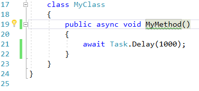
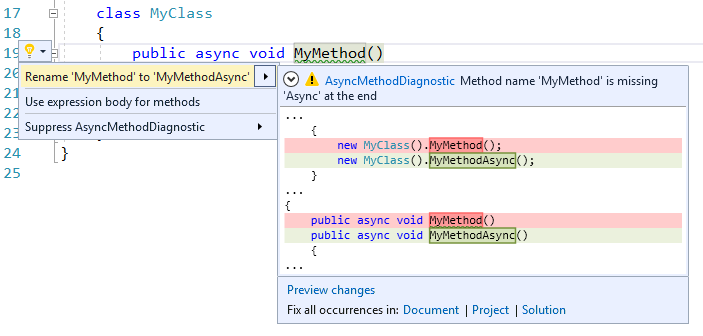
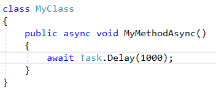

# AsyncMethodNameFixer

<!-- Replace this badge with your own-->

<!-- Update the VS Gallery link after you upload the VSIX-->
Download this extension from the [VS Gallery](https://visualstudiogallery.msdn.microsoft.com/[GuidFromGallery])
or get the [CI build](http://vsixgallery.com/extension/AsyncMethodNameFixer.3f1bd9bf-d048-4430-8705-1a26a4819614/).

---------------------------------------

The easiest way to analyze and fix method names for asynchronous methods.

See the [change log](CHANGELOG.md) for changes and road map.

## Features

- Fix Async Method Names

### Fix Async Method Names
If there is any asynchronous method violating the naming convention then the analyzer will show a warning and the lightbulb to fix it.

Clicking on lightbulb or pressing `Ctrl + . ` will show the fix with preview.

Pressing *return* will apply the fix and rename the method at all places.

## Contribute

For cloning and building this project yourself, make sure
to install the
[Extensibility Tools 2015](https://visualstudiogallery.msdn.microsoft.com/ab39a092-1343-46e2-b0f1-6a3f91155aa6)
extension for Visual Studio which enables some features
used by this project.

## License
[Apache 2.0](LICENSE)